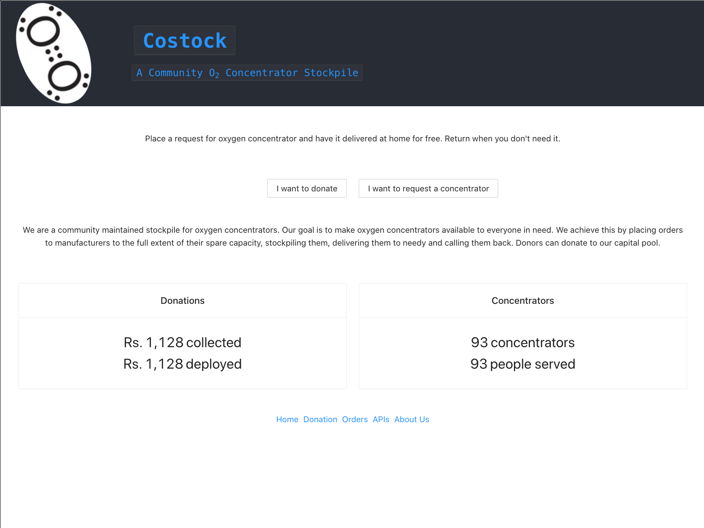

Costock
----

A redis backed O2 concentrator bank/stockpile management system. I has been implemented in Node.js with react frontend based on redis entirely(rdb+aof). We used redis gears function to allocate available concentrators to waitlisted orders as they arrive. This is in a way a workflow management happening through Gears.



The [demo video](https://www.youtube.com/watch?v=UjEoc8NvchE) has a short rundown of what the app is intended to do. 


# Data Model
We accept donations from public and use it to acquire O2 concentrators. People can request concentrators on the app. We maintain inventory of devices with us indexed by location and model. This way the delivery time and cost as saved. 

We implemented CRUD for donations, models(concentrator models as in make, specs etc), devices and orders.


# Docker commands

Copy the redis.conf from conf folder and use it for docker.

```
docker run -p 6379:6379 -v redis-data:/data -v redis-config:/usr/local/etc/redis --name redismod redislabs/redismod --include /usr/local/etc/redis/redis.conf

docker start redismod

docker stop redismod
```

Getting into the container
```
docker exec -it redismod bash
```

Running redis-cli
```
docker exec -it redismod redis-cli
```

# Running App

1. Run `npm install` and `npm start` in this folder(where README is). 
2. Go to the costock-react folder in a different terminal. Run `npm install` and `npm start` and that folder as well.


# Improvements

flatten models hashset
flatten donations into hashset


# TODOs

1. Request body validation
2. URL encoding
3. Login and user management
4. write unknown error handler. don't leak server error messages in response.
5. check ramifications of javascript int time treatment
6. redis command return value handling


----